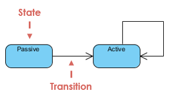

# UML Diagram

## Introduction

-   UML là ngôn ngữ mô hình hóa thống nhất (Unified Modeling Language).
-   UML là ngôn ngữ để:
    -   Trực quan hóa (visualizing)
    -   Đặc tả (specifying)
    -   Xây dựng (constructing)
    -   Tài liệu hóa (documenting)
-   UML là ngôn ngữ trực quan
-   Giúp công việc giải quyết một cách nhất quán, hạn chế lỗi trong quá trình xảy ra:
    -   Giúp dễ hình dung hơn cấu trúc của một hệ thống.
    -   Hiệu quả hơn trong việc làm nhóm (hoặc rộng hơn là ở giữa các nhóm).
-   UML là ngôn ngữ tài liệu hóa:
    -   Tài liệu hóa kiến trúc, yêu cầu, kiểm thử, lập kế hoạch dự án và quản lý việc bàn giao sản phẩm.
    -   Có nhiều dạng biểu đồ khác nhau, các ghi chú...
-   UML có thể áp dụng cho tất cả các pha của một quy trình phát triển sản phẩm.

## Tool draw UML diagram

-   Công cụ mã nguồn mở:
    -   EclipseUML
    -   UmlDesigner
    -   StarUML
    -   Argo UML...
-   Công cụ thương mại (trả phí):
    -   Enterprise Architect
    -   IBM Rational Software Architect
    -   Microsoft Visio
    -   Visual Paradigm for UML
    -   SmartDraw...

## UML Diagram Type

-   UML diagram có hai loại chính là: structure diagrams và behavioral diagrams.
-   Structure diagrams:
    -   Class Diagram (Biểu đồ lớp)
    -   Component Diagram (Biểu đồ thành phần).
    -   Deployment Diagram (Biểu đồ triển khai).
    -   Object Diagram (Biểu đồ đối tượng).
    -   Package Diagram.
    -   Profile Diagram.
    -   Composite Structure Diagram.
-   Behavioral Diagrams:
    -   Use Case Diagram (Biểu đồ use case).
    -   Activity Diagram (Biểu đồ hoạt động).
    -   State Machine Diagram.
    -   Sequence Diagram (Biểu đồ trình tự).
    -   Communication Diagram (Biểu đồ cộng tác).
    -   Interaction Overview Diagram.
    -   Timing Diagram.
-   Structure diagrams sẽ thể hiện các đối tượng khác nhau có trong một hệ thống.
-   Behavioral diagrams sẽ cho thấy những gì có thể xảy ra với hệ thống. Chúng mô tả cách các đối tượng tương tác với nhau để tạo ra một hệ thống.

### Class diagram

> Class diagram là khối chính trong bất kì các giải phát hướng đối tượng (object-oriented). Nó sẽ chỉ ra các lớp trong một hệ thống, các thuộc tính, hoạt động của từng lớp và mối quan hệ giữa các lớp.

-   Trong các tool vẽ UML thì một lớp (class) gồm ba thành phần:
    -   Tên lớp.
    -   Các thuộc tính.
    -   Các phương thức (Method, Function...).
        
-   Biểu diễn thuộc tính:
    -   Chỉ ra tên, kiểu và giá trị mặc định nếu có.
    -   Tuân theo quy ước đặt tên của ngôn ngữ của dự án.
        
-   Mô tả phương thức (Sử dụng trong lập trình hướng đối tượng).
-   Phạm vi truy cập (Sử dụng trong lập trình hướng đối tượng):
    -   Phạm vi truy cập được sử dụng để thực hiện khả năng đóng gói
    -   Sử dụng các ký hiệu
    -   `+`: Public access
    -   `#`: Protected access
    -   `-`: Private access
    -   `~`: Package / default
-   Mối quan hệ giữa các `Class` là trong đó một lợp chia sẽ cấu trúc hoặc hành vi với một hoặc nhiều lớp khác:
    -   Đơn kế thừa (Single inheritance)
    -   Đa kế thừa (Multiple inheritance)
        
-   Có 4 kiểu mối quan hệ :
    -   Inheritance: 1 class kế thừa từ 1 class khác.
    -   Association: 2 class có liên hệ với nhau nhưng không chỉ rõ mối liên hệ.
    -   Composition: Đối tượng tạo từ lass A mất thì đối tượng tạo từ class B sẽ mất.
    -   Agreegation: Đối tượng tạo từ lass A mất thì đối tượng tạo từ class B vẫn tồn tại độc lập.

### Component Diagram

> Component Diagram hiển thị mối quan hệ cấu trúc trong một hệ thống. Chúng được sử dụng chủ yếu với các hệ thống phức tạp với nhiều thành phần. các thành phần giao tiếp với nhau thông qua "Interface" or "Protocol".
> Component Diagram chia nhỏ hệ thống thực tế thành nhiều cấp độ khác nhau. Mỗi thành phần chỉ chịu trách nhiệm cho một mục tiêu trong toàn bộ hệ thống và chỉ tưởng tác trên cơ sở cần biết.

-   Trong UML 2, một `component` được vẽ là một hình chữ nhật. Có ba cách vẽ như sau:
    
-   `Interface`:
    
-   `Subsystem`: Đây là một phần nhỏ của một hệ thống và nó gồm nhiều `component` đề thực hiện một mục đích nhất định.
    
-   `Port`:Thường được sử dụng để hiện thị được yêu cầu và được cung cấp của một `component`
    
-   `Dependency`: Là một mối quan hệ biểu thị rằng một hoặc một tập hợp bị phụ thuộc vào một phần tử khác (Có thể hiểu đơn giản là cấu trúc của phần tử phụ thuộc vào định nghĩa của phần tử khác)
    

### Deployment Diagram

> Deployment Diagram hiển thị phần cứng hệ thống của bạn và phần mềm trong phần cứng đó. Deployment Diagram rất hữu ích nếu giải pháp phần mềm của bạn được triển khai trên nhiều phần cứng khác nhau.

-   Mục đích sử dụng của `Deployment Diagram`:
    -   Hiển thị cấu trúc của một hệ thống.
    -   Nắm bắt được các phần cứng được sử dụng của hệ thống.
    -   Mô hình hóa phần cứng vật lý và đường dẫn giao tiếp giữa chúng.
    -   Dùng để lập kế hoạch kiến trúc của một hệ thống.
    -   Là tài liệu hữu ích khi triển khai các thành phần.
-   `Step for Modeling an Embedded System:`
    -   Xác định các thiết bị hoặc nút cho hệ thống.
    -   Phân biệt giữa các devides và processors.
    -   Mô hình hóa các mối quan hệ devides và processors.
        

### Object Diagram

> Object Diagram, đôi khi nó khá giống với `Class Diagram`. Giống như `Class Diagram` chúng cũng hiển thị mối liên hệ giữa các đối tượng nhưng nó đươc sử dụng trong các ví dụ thực tế.
> Chúng cho thấy hệ thống như thế nào tại một thời điểm nhất định. Bởi vì có sẳn dữ liệu trong các đối tượng nên chúng được sử dụng để giải thích các mối quan hệ phức tạp giữa các đối tượng.

-   `Object Diagram` được sử dụng khá hạn chế, chủ yếu nó đưa ra một ví dụ dựa trên `CLass Diagram`

### Package Diagram

> Như cái tên đã nói lên, Package Diagram cho thấy sự phụ thuộc giữa các **package** trong hệ thống. Tham khảo [Wikipedia Package diagram](https://en.wikipedia.org/wiki/Package_diagram).
> Loại Diagram chỉ hổ trợ cho ngôn ngữ có hổ trợ loại hình Package như Java.

### Profile Diagram

> Profile Diagram là một loại diagram được giới thiệu trong UML 2. Đây là một loại diagram hiếm khi sử dụng.

### Composite Structure Diagram

> Composite Structure Diagram được sử dụng để hiển thị cấu trúc bên trong của một lớp.
> Có thể sử dụng loại Diagram này trong ứng dụng Embedded như ví dụ sau:

### Use Case Diagram

> -   Use Case Diagram là loại diagram được biết đến trong số các loại `Behavioral Diagrams`, nó cung cấp một cách nhìn tổng quan bằng hình ảnh các tác nhân tham gia vào một hệ thống, các chức năng mà tác nhân đó cần và cách các chức năng này tương tác với nhau.
> -   Đây là khơi đầu cho bất kì cuộc thảo luận dự án vì bạn có thể xác định một các dễ dàng các tác nhân chính có liên quan và các quy trình chính của hệ thống.

-   Mục đích sử dụng của loại diagram này:
    -   Chỉ định bối cảnh của hệ thống.
    -   Nắm bắt yêu cầu của hệ thống.
    -   Xác nhận kiến trúc của hệ thống.
    -   Triển khai và kiểm thử hệ thống.
    -   Sử dụng để thảo luận với khách hàng.
-   Các thành phần chính:
    -   Tác nhân (actor):
        -   Là bất kì tương tác với hệ thống, có sự trao đổi dữ liệu với hệ thống:
            -   Người dùng.
            -   Thiết bị phần cứng.
            -   Hệ thống khác.
        -   Không phải là một phần của hệ thống.
            **Ví dụ: Hệ thống trả lời tự động**
            
        -   Xác định tác nhân:
            -   Đặt các câu hỏi sau:
                Nhóm người nào yêu cầu hệ thống làm việc giúp họ?
                Nhóm người nào kích hoạt chức năng của hệ thống?
                Nhóm người nào sẽ duy trì và quản trị hệ thống hoạt động?
                Hệ thống có tương tác với các thiết bị hay phần mềm nào khác không?
            -   Thông tin về tác nhân: Tên của tác nhân phải nêu lên được vai trò của tác nhân đó như là Customer, Management...
    -   Use case:
        -   Mô tả chức năng của hệ thống, là một chuỗi các hành động của hệ thống thực hiện nhằm thu được một kết quả dễ thấy tới một tác nhân nào đó.
        -   Một use case mô hình hóa giữa một hoặc nhiều tác nhân với hệ thống.
        -   Một use case mô tả hành động của hệ thống thực hiện nhằm mang đến một giá trị nào đó cho tác nhân.
            
        -   Xác định use case:
            -   Xem các yêu cầu chức năng.
            -   Đối với mỗi tác nhân tìm được, đặt các câu hỏi:
                Các tác nhân yêu cầu những gì từ hệ thống?
                Các công việc chính mà tác nhân đó muốn hệ thống thực thi?
                Tác nhân đó có tạo ra hay thay đổi dữ liệu gì của hệ thống?
                Tác nhân đó phải thông báo gì cho hệ thống?
                Tác nhân đó cần thông tin thông báo gì từ hệ thống?
            -   Thông tin về use case: Tên của use case chỉ rõ được kết quả của quá trình tương tác với cá nhân như là: Display, Block...
        -   Những điều cần tránh khi tạo use case:
            -   Tạo ra các use case quá nhỏ.
            -   Tạo ra quá nhiều use case.
            -   Sử dụng các use case quá cụ thể hoặc làm việc với dữ liệu quá cụ thể.
    -   Relationship (mối quan hệ):
        -   Giữa các actor:
            -   Khái quát hóa(Generation): Tác nhân con kế thừa tính chất và hành vi của tính chất cha.
                
            -   Giao tiếp (Association): Các tác nhân tương tác với nhau (gửi và nhận thông điệp).
                
        -   Giữa các actor với use case: Sủ dụng `association` để actor và use case tương tác với nhau.
            
        -   Giữa các use case:
            -   Generation:
                -   Được sử dụng để chỉ ra một vài tính chất của một nhóm tác nhân hoặc use case.
                -   Sử dụng khái niệm kế thừa: - Mô tả hành vi chung của use case cha. - Mô tả hành vi riêng của use case con.
                    
            -   `<< include >>`:
                -   Cho phép một use case sử dụng chức năng của một use case khác.
                -   Chức năng của use case `Inclusion` sẽ được gọi trong use case `Base`.
                    
                -   Sử dụng stereotype là `<<include>>`.
                    
            -   `<< extend >>`:
                -   Cho phép mở rộng chức năng của một use case.
                -   Chèn hành vi của use case `Extension` vào use case `Base`.
                    
                -   Sử dụng stereotype là `<<extend>>`.
                    

### Activity Diagram

> Activity Diagram thể hiện workflow bằng cách mô hình hóa nó. Chúng có thể được sử dụng để mô tả quy trình công việc hoặc quy trình hoạt động của bất kì thành phần nào trong hệ thống. Đôi khi nó có thể được sử dụng thay thế cho `State Machine Diagram`. Tham khảo [Wikipedia Activity diagram](https://en.wikipedia.org/wiki/Activity_diagram) cách sử dụng các symbol.
> Nó khá giống với cách vẽ flow chart.
> 

-   Gọi một `activity diagram` khác trong khi vẽ `activity diagram`:
    
-   Phân chia (Partition):
    -   `Acticity diagram` chỉ mô tả điều gì sẽ xảy ra chứ không mô tả ai làm gì.
    -   Nếu muốn chỉ ra ai làm gì thì có thể phân chia thành các phần bao gồm các hoạt động do ai làm.
    -   Có thể phân chia theo một chiều (hàng hoặc cột) hoặc hai chiều (cả hàng và cột).
        

### State Machine Diagram

> -   State Machine Diagram tương tự như `Activity Diagram`, mặc dù các **_kí hiệu_** và **_cách sử dụng_** thay đổi một chút. Thường biết đến với cái tên khác `State Diagram` hoặc `State Chart Diagram`. Chúng rất hữu ích để mô tả hành vi của các đối tượng khác nhau tùy theo trạng thái hoạt động của chúng tại từng một thời điểm.
> -   Thường được sử dụng chung với `Sequence diagram`. Trong đó `State Machine diagram` mô tả các sự kiện, còn `Sequence diagram` mô tả các sự kiện cho một tương tác trên tất cả các đối tượng liên quan.

-   `State`: là một ràng buộc hoặc một tình huống trong vòng đời của một đối tượng, trong đó ràng buộc giữ nguyên, đối tượng hoạt động hoặc chờ đợi một sự kiện.
    
    
-   `Initial and Final States`: `Initial States` là trạng thái mở đầu và `Final States` trạng thái kết thúc của một chu trình.
    
    Ở ví dụ này có xuất hiện **cancel order**, **request shipment** ... được gọi là action.
-   `Entry and Exit Actions`: được chỉ định trong trạng thái. Nó phải đúng với mọi lần xuất hiện **entry / exit**. Nếu không thì phải sử dụng các hành động trên ở các nhánh riêng lẻ.
    -   `Entry Action` được thực hiện khi nhập vào trạng thái với ký hiệu: `Entry / action`.
    -   `Exit Action` được thực hiện khi thoát khỏi trạng thái với ký hiệu: `Exit / action`.
        
-   `Substate`: là một `state` gồm nhiều `state` nhỏ hơn ở trong.
    
<!-- -   `History States`:
-   `Concurrent State`: -->
-   Phân biệt `State Machine Diagram` và `Activity Diagram`:
    

### Sequence Diagram

> `Sequence Diagram` chỉ ra cách mà các đối tượng tương tác với nhau và thứ tự xảy ra các tương tác đó. Điều quan trọng là chúng hiển thị các tương tác trong một tình huống cụ thể. Các quy trình được thể hiện theo chiều dọc và các tương tác hiện thị dưới dạng mũi tên.

-   `Sequence Diagram` chỉ ra:
    -   Các đối tượng tham gia vào tương tác.
    -   Thời gian sống của các đối tượng.
    -   Trình tự các thông điệp được trao đổi.
        

### Communication Diagram

> -   `Communication Diagram` (hoặc Collaboration Diagram) tương tụ như `Sequence Diagram` nhưng nó tập trung vô các **_message_** được truyền giữa các đối tượng.
> -   `Communication Diagram` nhấn mạng vào việc tổ chức các đối tượng tham gia vào tương tác.

-   `Communication Diagram` chỉ ra:
    -   Các đối tượng tham gia vào tương tác.
    -   Các liên kết giữa các đối tượng.
    -   Các thông điệp trao đổi giữa các đối tượng.
        
-   `Sequence Diagram` vs `Communication Diagram`:
    -   Giống nhau:
        -   Tương đương về ngữ nghĩa:
            -   Cùng đưa ra thông tin về sự tương tác giữa các đối tượng qua các thông điệp.
            -   Có thể chuyển đổi giữa hai biểu đồ mà không mất mát thông tin.
        -   Mô hình hóa phương diện rộng của hệ thống.
        -   Mô hình hóa kịch bản use case.
    -   Khác nhau:

| Sequence Diagram                                                            | Communication Diagram                                                                                        |
| --------------------------------------------------------------------------- | ------------------------------------------------------------------------------------------------------------ |
| Chỉ ra thứ tự rõ ràng của các thông điệp                                    | Chỉ ra mối quan hệ rõ ràng giữa các đối tượng                                                                |
| Thể hiện tốt hơn luồng công việc                                            | Thể hiện tốt hơn quá trình giao tiếp                                                                         |
| Mô hình hóa trực quan hơn toàn bộ luồng thực thi (theo thời gian)           | Mô hình hóa trực quan hơn cho tất cả các ảnh hưởng của đối tượng                                             |
| Thể hiện tốt hơn đối với các đặc tả thời gian thực và các kịch bản phức tạp | Thể hiện rõ hơn hiệu quả của quá trình tương tác trên từng đối tượng, dễ hiểu hơn cho các buổi brainstorming |

### Interaction Overview Diagram

> -   Interaction Overview Diagram rất giống với `Activity Diagram`. Trong khi `Activity Diagram` thể hiện trình tự của các quy trình thì `Interaction Overview Diagram` thể hiện trình tự của các tương tác.
> -   Nó là tập hợp các sơ đồ tương tác và thứ tự chúng xảy ra. Như đã đề cập trước đó, có 7 loại **interaction diagram**, bất kì loại nào cũng có thể là một **_node_** trong `Interaction Overview Diagram`.
- Cách vẽ giống với `Activity Diagram` thay vì một node là action thì ở loại diagram này là Interaction.

### Timing Diagram

> Là một dạng sơ đồ trình tự sử dụng đồ thị và sóng để mô tả hành vi và tương tác giữa các đối tượng và thời gian của sự kiện xảy ra trong một khoảng thời gian nhất định.

## Reference

> [UML Diagram Types Guide: Learn About All Types of UML Diagrams with Examples](https://creately.com/blog/diagrams/uml-diagram-types-examples/) 
> [Learning UML](https://www.visual-paradigm.com/guide/)
> [Timing Diagram](https://www.edrawmax.com/article/timing-diagram-explained.html)
